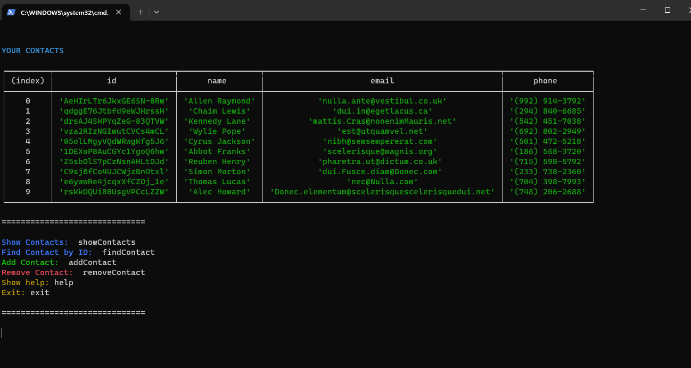
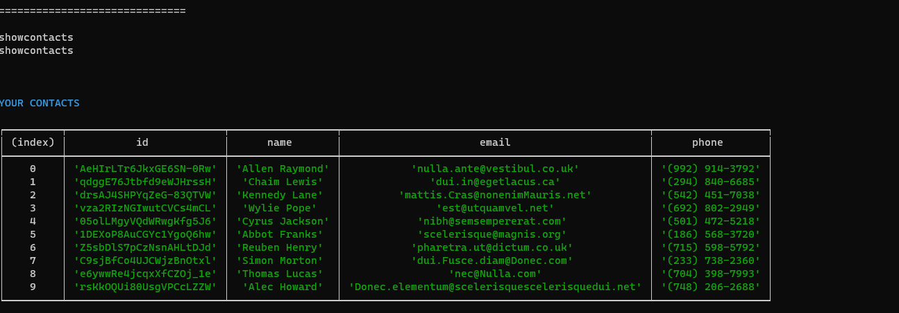
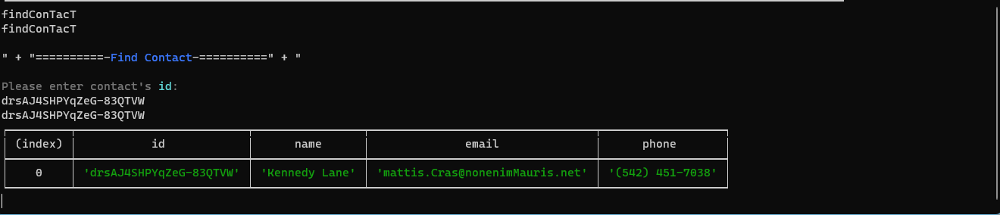
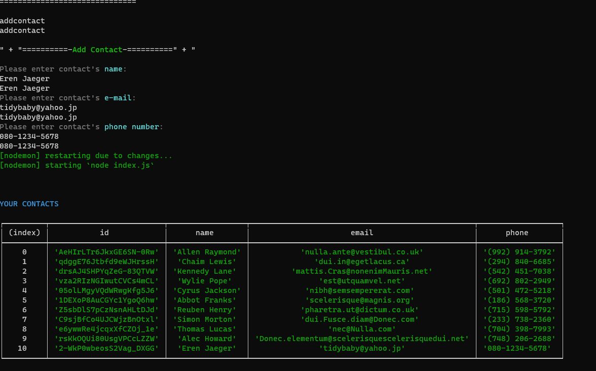
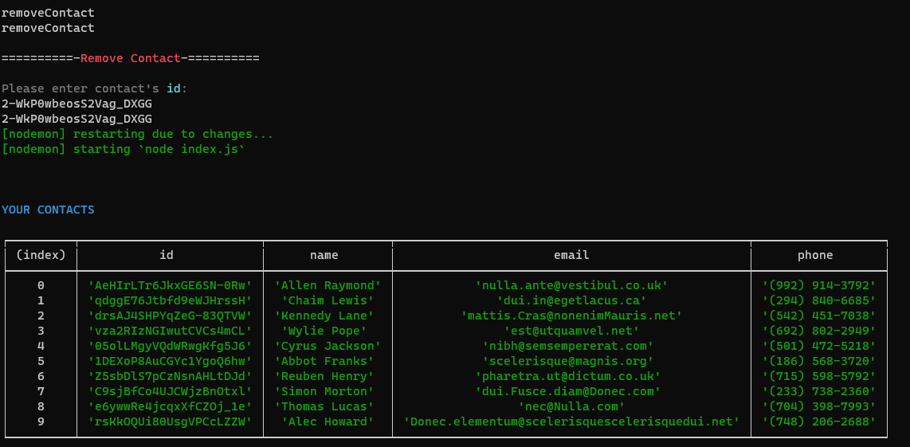

# goit-nodejs-7 - Simple CLI contact's menager created using node.js.

## Home

## List Contacts

## Find Contact (nanoid <3)

## Add Contact

## Remove Contact

### Double commands problem

I'm not sure  why this keeps happening. I assume that's nodemon is causing this. 
When I run this on simple "node index.js" everything seems normal but program doesn't keep track of changes.
